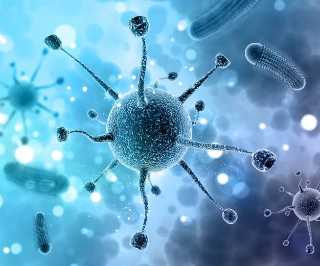
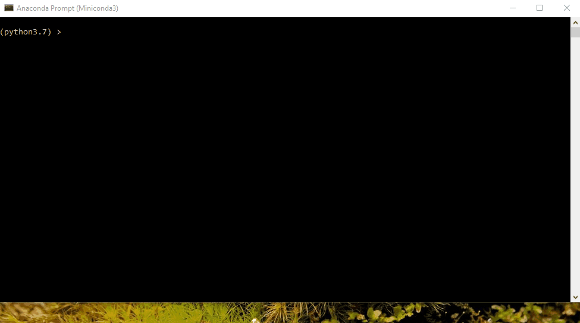

# Stochastic Simulation

||
|--:|
|Picture's [link](https://hope.be/hope_working_area/antimicrobial-resistance/3d-medical-background-with-abstract-virus-cells_1048-6296/)|

In this project, I design and implement a stochastic simulation of patient and virus population dynamics, and reach conclusions about treatment regimens based on the simulation results.

### Background Information - Viruses :microbe:, Drug Treatments :pill:, and Computational Models :computer:

Viruses such as HIV and H1N1 represent a significant challenge to modern medicine. One of the reasons that they are so difficult to treat is their ability to evolve.

As you may know from introductory biology classes, the traits of an organism are determined by its genetic code. When organisms reproduce, their offspring will inherit genetic information from their parent. This genetic information will be modified, either because of mixing of the two parents' genetic information, or through mutations in the genome replication process, thus introducing diversity into a population.

Viruses are no exception. Two characteristics of viruses make them particularly difficult to treat. The first is that their replication mechanism often lacks the error checking mechanisms that are present in more complex organisms. This speeds up the rate of mutation. Secondly, viruses replicate extremely quickly (orders of magnitude faster than humans) -- thus, while we may be used to thinking of evolution as a process which occurs over long time scales, populations of viruses can undergo substantial evolutionary changes within a single patient over the course of treatment.

These two characteristics allow a virus population to acquire genetic resistance to therapy quickly. In this project, I will make use of simulations to explore the effect of introducing drugs on the virus population and determine how best  to address these treatment challenges within a simplified model. Moreover, I'll be looking at a detailed simulation of the spread of a virus within a person. 

# Code in Action

In this section, we can see the final results of the implementations.

## Simulation without Drug Treatment

The following shows the simulation for the person who doesn't take any drug treatment:

## Simulation with Drug Treatment

The following shows the simulation for the person who takes a drug treatment after time step 150. It is worth noting that as the virus population reproduces, mutations will occur in the virus offspring, adding genetic diversity to the virus population. Some virus particles gain favorable mutations that confer resistance to drugs.

The orange line shows the viruses that are resistant to the treatment. As it's clear from the plot, we can see that after beginning of the treatment, the total population of viruses decreases radically. But over time, all the viruses become resistant to the treatment as a result of mutation.

